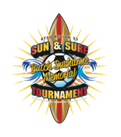

## Butch Ducharme Memorial Sun and Surf Tournament

**To be held on June 18th and 19th 2016.**

**Open for Ages U8-U19, boys and girls**

**See the [Flyer](SunSurfFlyer.pdf) for information**

The following documents are available:

* Ages U10-U19
	* [Tournament Application](2016%20Team%20Application%20Instructions.pdf)
	* [Tournament Rules](Sun%20Surf%20Tournament%20Rules.pdf)
	* [Referee Plan](Referee%20Plan.pdf)

* Age U8
	* [Tournament Application and Rules](U8%20Application%20Instructions.pdf)

There is a $1 charge for parking each day at the Sports complex. The parking permit dispensers accept $1 bills, coins, credit cards and debit cards. No change is available. The city of Huntington Beach makes a tidy sum off of parking tickets each year.

On line registration is available at (http://www.ayso11k.org/cgi-bin/ol_print_start_page.pl?tourny_name=sun_surf)

JavaScript and cookies must be enabled on your browser. You must reload every page you visit the first time you visit the page.  This is done by clicking:

* Chrome: the circular arrow to the left of the address bar
* Firefox: the circular arrow at the far right in the address bar
* Internet Explorer (ver 8): The up/down green arrows to the right of the address bar (may be different in later versions of IE)

Known to work with:
* Firefox version 35.01
* Chrome version 32.0.1700.76m
* IE version 8.0.6001.18702. Does not work with IE version 9 unless you are running compatibility mode.

Running on Windows XP sp, 32 bit. Other browsers, e.g., Safari, Opera, AOL, not tested nor known to work or fail.

If you have any questions, or if the software breaks, contact the [section 11K webmaster](mailto:wbmstr@ayso11k.org).

<!--

[Promotional Flyer](SunSurfFlyer.pdf) and Rules

*AYSO Region 55 is proud to invite your team to the Butch Ducharme Memorial Sun & Surf Tournament*

*Scope:*	AYSO Invitational open to AYSO teams only from all Sections.

*When:*	Saturday & Sunday, June 18 and 19, 2016 

*Where:*	The tournament will be held at Huntington Beach Sports Complex in Huntington Beach, California. No pets are allowed at fields.

*Who:*	AYSO boys and girls teams in age divisions: U-19, U-16 (11v11) 18 players max. U-14 (11v11) 15 players max. U-12 (9v9) 12 players max. and U-10 (7v7) 10 players max. All players must be registered to play in the AYSO 2015 season.

*What:*	Pool play tournament. Each team will be guaranteed 3 games in pool play. The top teams will advance to the medal round on Sunday afternoon. All games will be as follows: (50 min. for U-19 & U-16, 50 min. for U-14, 50 min for U-12, and 50 min for U-10).

*Why:*	The Butch Ducharme Memorial Sun & Surf Tournament is being conducted as a fundraiser by Region 55 to raise funds for Field Development, Equipment, & Maintenance, and to provide Scholarship funds for youths in Region 55.

*Awards:*	All players and 2 coaches per team will receive a tournament t-shirt and pin. All players on the 1st, 2nd, 3rd, & 4th place teams will receive a medal.

*Entry Fee, Refunds:*	$550 for U-19 & U-16, $525 for U-14 & U-12, and $450 for U-10. A full refund will be issued if tournament is canceled and cannot be rescheduled. If a team withdraws 30 or more days before the tournament, a full refund is given. Within 30 days of the tournament, no refund is provided unless a replacement team is found.

*Referee Fee, Refunds:*	$300, refundable within 14 days of the tournament, if referee assignments have been completed. Each team is asked to provide a qualified 3-person referee team to cover 3 games during the tournament. 

*Rules:*	A full set of tournament rules are posted on the tournament website.

*Acceptance:*	The application deadline is May 17th. All teams will be notified within 1 week of the application deadline or receipt of application (whichever is latest) as to their status. 

*How:*	Apply online at (http://www.ayso11k.org/cgi-bin/ol_print_start_page.pl?tourny_name=sun_surf)  Please send 1 Region check to cover both the Team Entry and Referee fees to the address below.

Make region check payable to: AYSO Region 55 Sun & Surf Tournament.

*Address:*
<pre>
Tournament Registrar
Butch Ducharme Memorial Sun & Surf Tournament
P.O. Box 1852
Huntington Beach, CA 92647
</pre>

*Information:*
<pre>
Call Melissa Delgleize  (714) 585-3161
E-mail:  sunsurf@ayso55.org
Web site:   http://ayso55.org/sunsurf
</pre>

-->